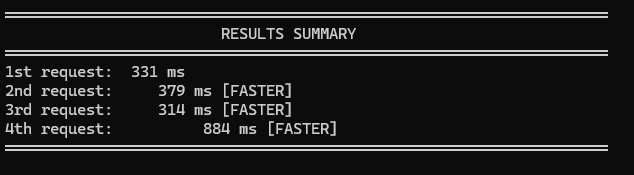
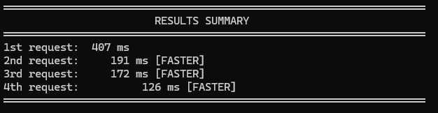

# HackerBestStories

API ASP.NET Core para consumir e disponibilizar as melhores histórias do Hacker News com cache Redis.

## Pré-requisitos

- [.NET 10.0 SDK](https://dotnet.microsoft.com/download)
- [Docker & Docker Compose](https://www.docker.com/)

## Execução

### Docker Compose (Recomendado)
A aplicação agora utiliza **Redis** para cache de dados. Execute com Docker Compose:

```bash
docker-compose up
```

API disponível em: `https://localhost:5000`  
Documentação: `https://localhost:5000/scalar/v1`

### Local (Sem Docker)
Para desenvolvimento local:
```bash
dotnet restore
cd HackerBestStories.API
dotnet run
```

> Nota: Certifique-se de ter um servidor Redis rodando localmente na porta 6379

### Compilar
```bash
dotnet build
```

### Testes
```bash
dotnet test
```

### Publicar
```bash
dotnet publish -c Release
```

## Teste e Avaliação

### Testar via Scalar
A documentação interativa Scalar permite testar os endpoints da API:

```bash
# Com Docker Compose rodando
Acesse: https://localhost:5000/scalar/v1
```

### Executar Benchmark

Para avaliação de performance, o projeto inclui benchmarks usando **BenchmarkDotNet**:

**1. Inicie a aplicação com Docker Compose:**
```bash
docker-compose up
```

**2. Em outro terminal, execute o benchmark:**
```bash
cd HackerBestStories.Benchmark
dotnet run -c Release
```

Os resultados são exportados automaticamente em `BenchmarkDotNet.Artifacts/`

### Comparação de Performance

#### Sem Cache Redis


#### Com Cache Redis


O cache Redis melhora significativamente o tempo de resposta nas requisições subsequentes.
